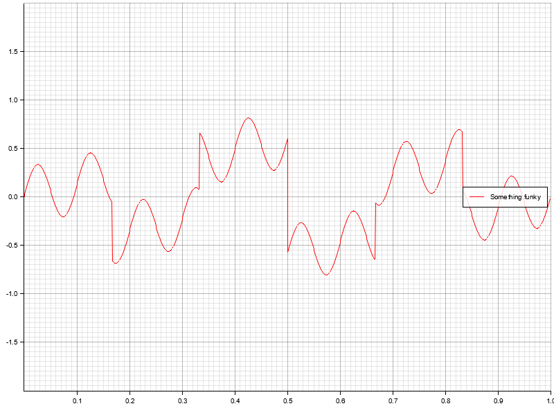

# wavegen

[](https://crates.io/crates/wavegen)
[](https://docs.rs/wavegen/0.1.0/wavegen/)

`wavegen` is a wavefrom generator made with 🦀

Refer to [documentation](https://docs.rs/wavegen/0.1.0/wavegen/) for more exhaustive usage examples.

## How to use it?

1) Define a waveform with sampling frequency and function components

```rust
let wf = Waveform::<f64>::with_components(200.0, vec![sine!(100, 10), dc_bias!(20)]);
```

2. Turn it into an iterator and sample

```rust
let some_samples: Vec<f64> = wf.into_iter().take(200).collect();
```

## Show me some examples!

* Simple sine


* Two superposed phase-shifted sines


* "Real life" example: 300Hz sine signal with 50Hz interference noise


* Sawtooth


* Superposition of sine + sawtooth


* Square wave


* Superposition of Sine, Square and Sawtooth with different frequencies



All above examples are generated with simple program found in `examples/plot.rs`. Run `cargo run --example plot` to generate them yourself.

## `no_std`

`no_std` support can be enabled by disabling the default `std` feature and enabling the `libm` backend, required for trygonometry functions:

```toml
[dependencies]
wavegen = { version = "0.2", default-features = false, features = ["libm"] }
```

## Similar crates
* [Waver](https://github.com/amrali/waver/) which was the inspiration for this crate
