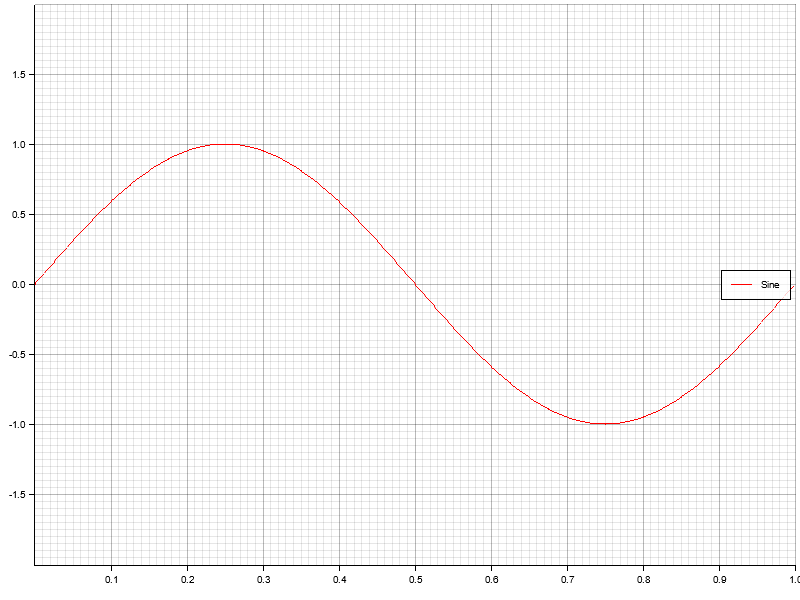

# wavegen

`wavegen` is a wavefrom generator made with 🦀

Refer to [documentation](https://) for usage examples.

## What can it do?

1) Define a waveform iterator

```rust
let wf = Waveform::<f64>::with_components(200.0, vec![sine!(100, 10), dc_bias!(20)]);
```

2. Use it

```rust
let some_samples: Vec<f64> = wf.into_iter().take(200).collect();
```

## Show me some examples!

* Simple sine



* Two superposed phase-shifted sines


* Sawtooth


* Superposition of sine + sawtooth


* Square wave


All above examples are generated with simple program found in `examples/plot.rs`. Run `cargo run --example plot` to generate them yourself.
