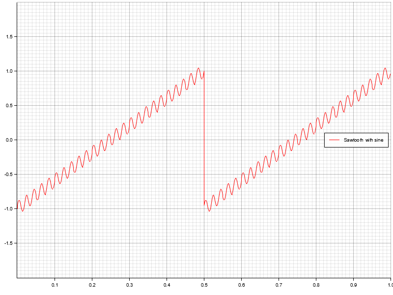

# wavegen

[](https://crates.io/crates/wavegen)
[](https://docs.rs/wavegen)
[](https://app.bors.tech/repositories/46467)

`wavegen` is a wavefrom generator made with 🦀

## How to use it?

1) Add `wavegen` to your project:

```toml
[dependencies]
wavegen = "0.4"
```
Or, to use the *no_std* version (custom global allocator is required):

```toml
[dependencies]
wavegen = { version = "0.4", default-features = false, features = ["libm"] }
```

2) Define a waveform with sampling frequency and function components:

```rust
let waveform = wf!(f64, 200, sine!(frequency: 100., amplitude: 10.), dc_bias!(20.));
```

3) Turn it into an iterator and sample:

```rust
let some_samples: Vec<f64> = waveform.iter().take(200).collect();
```

Refer to [documentation](https://docs.rs/wavegen) for more exhaustive usage examples.

## Show me some examples!

### Interactive demo

Check out the demo at https://wavegen-demo.netlify.app

### Plot charts

* Simple sine


* Two superposed phase-shifted sines


* "Real life" example: 300Hz sine signal with 50Hz interference noise


* Sawtooth


* Superposition of sine + sawtooth



* Square wave


* Superposition of Sine, Square and Sawtooth with different frequencies


All above examples are generated with simple program found in `examples/plot.rs`. Run `cargo run --example plot` to generate them yourself.

## MSRV

The *Minimum Supported Rust Version* is `1.60`.

## Similar crates
* [Waver](https://github.com/amrali/waver/) which was the inspiration for this crate

## Breaking changes

### 0.2

- Braking change in how macros are annotated, changing the annotation form from `frequency = n` to `frequency: n`

### 0.4

- `Waveform::get_sample_rate` renamed to `Waveform::sample_rate` and now returns a borrowed values, as per rust API specs.
- `Waveform::get_components_len` removed. The functionality can be achieved by a new getter `Waveform::components`.
